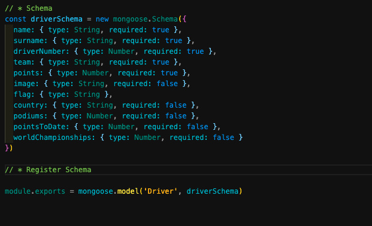
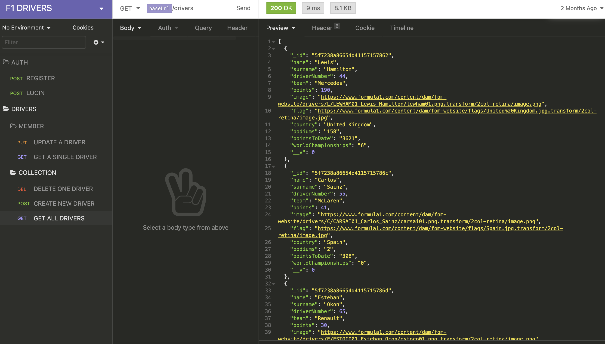
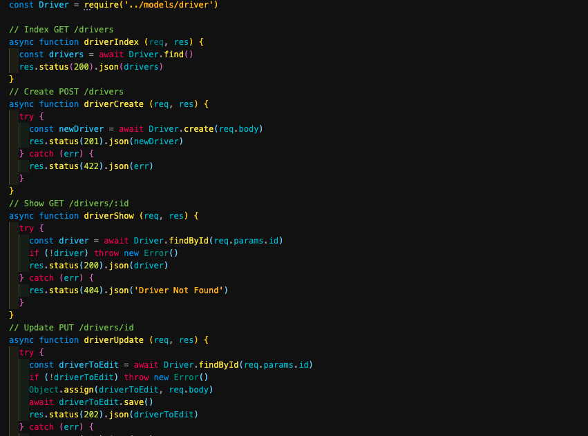
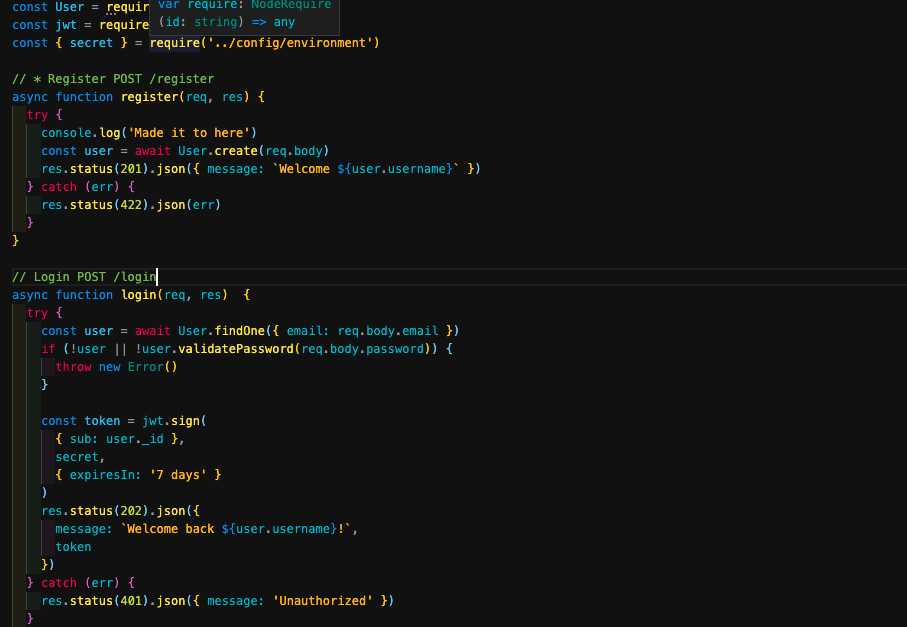
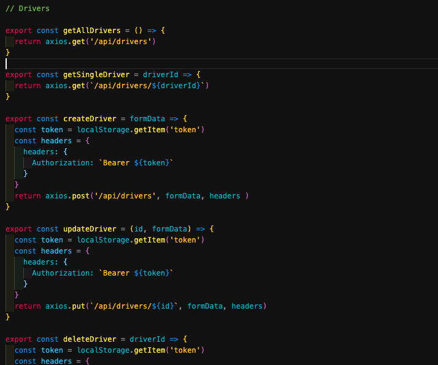
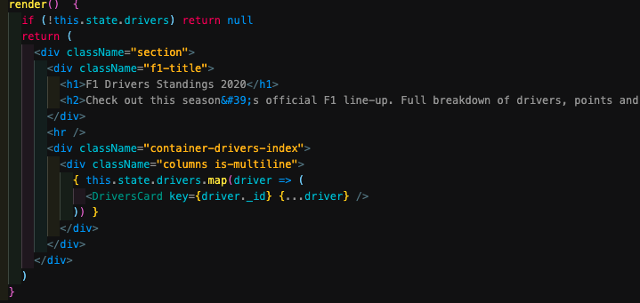
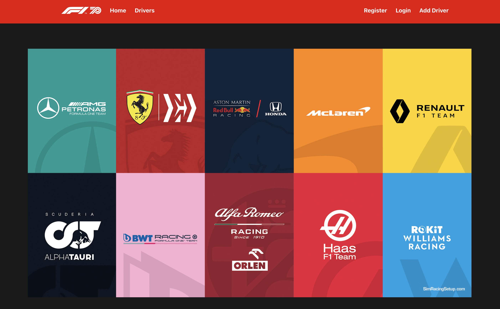
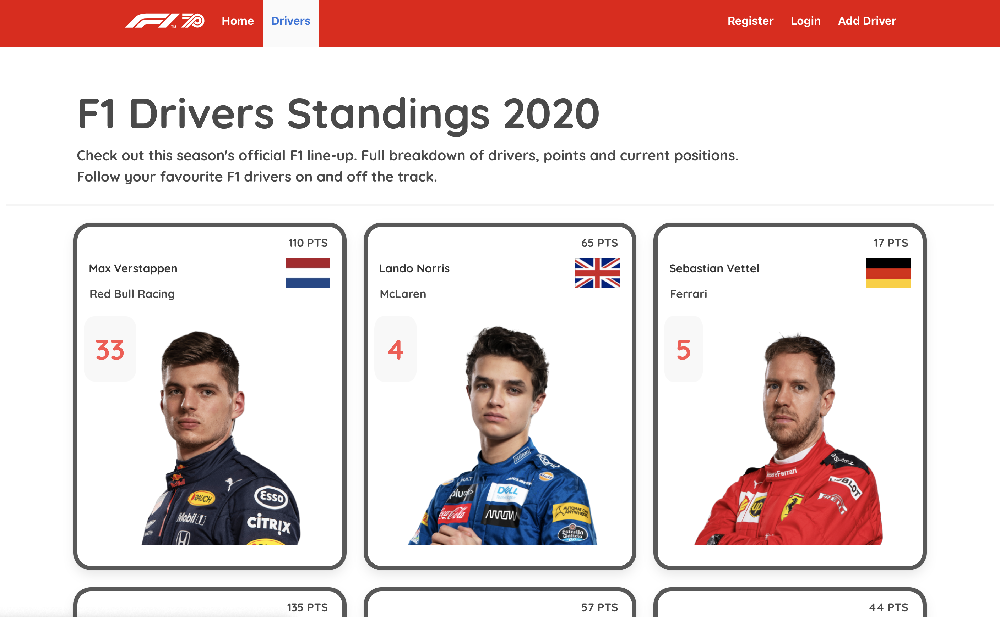
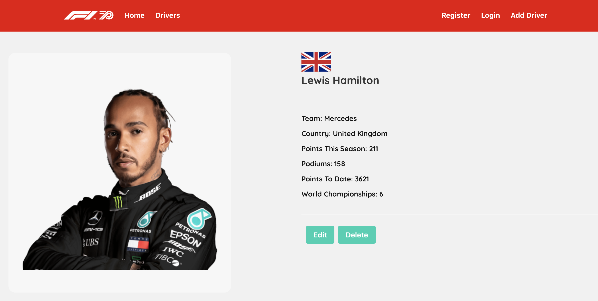
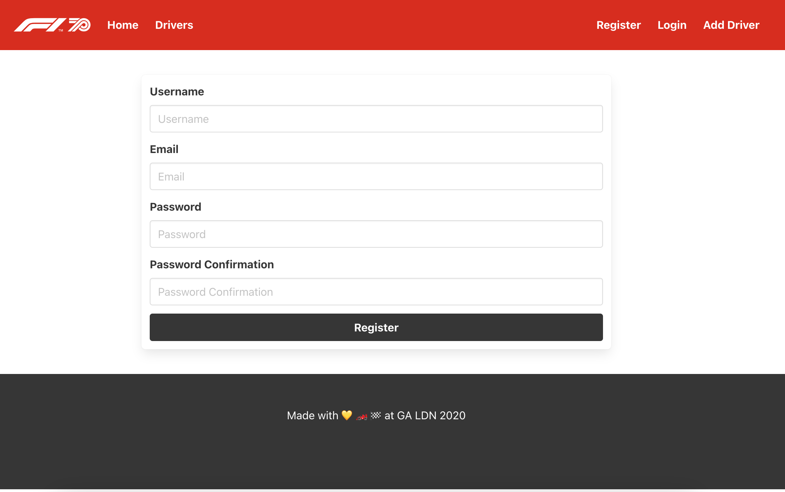

# SEI 50 Project 2  - Formula One API

## Table of contents 

* Installation
* Launch App
* Overview 
* The Brief
* Technologies Used
* Approach
* Final Product - (screenshot walkthrough)
* Wins & Blockers
* Future Content and Improvements

 

## Installation

Clone or download the repo then do the following in Terminal:

- Install dependencies `npm i`
- Start the database `mongod --dbpath ~/data/db`
- Start the back-end server using nodemon `npm index.js`
- Change into front-end directory: `cd frontend`
- Install front-end dependencies: `npm i`
- Start front-end server: `npm run start`

 

## Launch The App
https://formula1-api.herokuapp.com

 

## Overview 

Formula One API shows information about the drivers competing in the 2020 FIA F1 Championship, such as current points, how many podiums and points in their career, which team and other statistics. The App allows users to register and then be able to create a driver and edit their details or even delete drivers when necessary. 

 

## Project Brief 
* Build a full-stack application by making your own backend and your own front-end
* Use Node.js with Express API to serve your data from a Mongo database.
* Consume your API with a separate front-end built with React
* Be a complete product which most likely means multiple relationships and CRUD functionality for at least a couple of models
* Implement thoughtful user stories/wireframes that are significant enough to help you know which features are core MVP and which you can cut
* Be deployed online so it's publicly accessible.

 

## Technologies Used 

### Backend:
- Node
- Express
- Mongo DB
- Faker
- Bcrypt
- Mongoose
- JWT

### Frontend:
- React
- JavaScript
- Axios
- Bulma
- SASS
- Nodemon
- React Router Dom

### Development tools:
- VS code
- NPM 
- Insomnia
- Git
- Github
- Google Chrome dev tools
- Heroku
- Coolers
- Zoom
- Slack

 
 

## Approach

Project 2 was my first time building a full stack application. I used Node and Express with Mongo DB to serve data to a front end built with React. The idea for the Formula One API was based on my following of the sport. For this project I focused on just the drivers information and on trying to set up the full stack correctly, and then style as best possible.

## Day 1 

First, I planned what I wanted the app to provide in terms of info and user experience.

- Homepage to display all the formula one constructors and link to all drivers page.
- Drivers page to display all the drivers as cards type display.
- Show page would link from all drivers to display more info about 1 driver.
- Users can view this info without logging in.
- Users need to to register and login in order to be able to create, update and delete drivers.

### Back-end

Next step was to create the backend with Node / Express API and Mongo DB

First, I created a schema model for the drivers, I started with a basic version and later went back to it to add all the fields I wanted.
 
 

 
 
Next, I created the api requests using Insomnia to test the requests first. This ensured everything was working as expected before starting with the code. 
 
 

 
 

The next step for me was to create the backend for Create, Read, Update, Delete. And then add in the user registration and login requests.

**Create, Read, Update, Delete:**
 

 
 

**Register and Login:**

 
 

Once the backend was completed, I added React for frontened and began working on it.
The first task was to plan and create a basic folder and file structure that I would use, and also how I would use components to display info.

Then I created the code for the api requests for Show, Create, Update, Delete drivers.
The main thing here, was for me to go step-by-step and do one of these at a time, testing first on Insomnia, then along the way and correcting any errors as I went. 

**API requests for Create, Read, Update, Delete with Authorization:**
 

 
 

## Show All, Show One and Create and Edit new drivers ##

Next, I put together the code for showing all drivers, show one driver, the show all drivers was fairly straight-forward as I used Bulma for styling the cards and the spread operator for displaying all drivers in React.
 

## Final Product - (screenshot walkthrough)

**Homepage:**

 
 

**Drivers:**

 
 

**Driver Details:**

 
 

**Register:**

 
 

 
 

## Wins & Blockers

One of the main challenges for me was getting the URLs correct when creating the api requests in frontend. The key takeaway instead was to learn how to interpret error messages in order to go and correct them. This project gave me a greater understanding about working with error messages generally and viewing them as a helpful resource.

A win was getting the CRUD functionality to work properly, alongside getting the authorization working for users. I think the stying worked out well, I managed to get it looking how I planned for desktop version so I was happy with this aspect.

 
 

## Future Content and Improvements

For future improvements, I think it would be great to display some messages to the users when they login, logout, when they create a driver successfully and generally when filling out forms. The backend is set up for allowing this. 

Another improvement would be to make it responsive, the app is currently built for desktop, so mobile and tablet versions are required, ideally.

I can also look to show and hide certain buttons / links to users depending on weather users are logged in or not. 

It would also be great to add all the circuits around the world, with diagrams and information etc, and then finally the Constructors need adding alongside tables showing current driver standings and constructor standings. 

 
 

